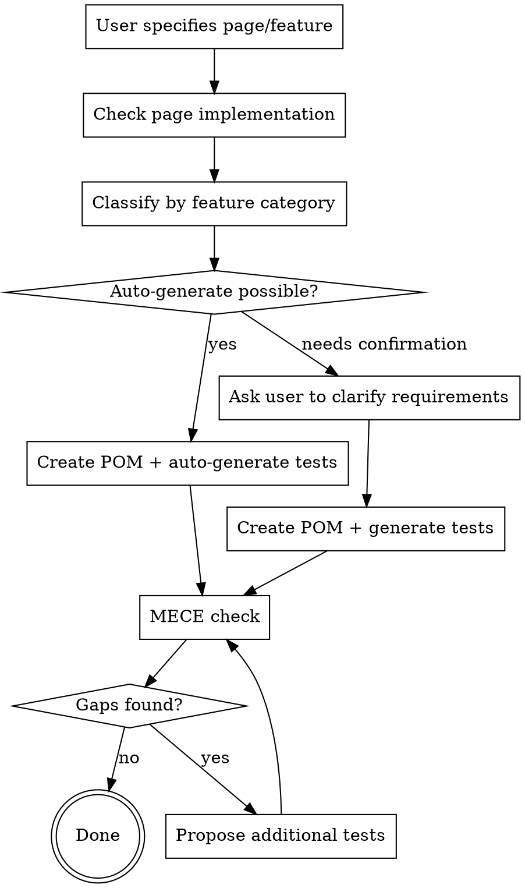

# Playwright E2E Test Creation

## Overview

Organize tests MECE by feature axis using Playwright. Auto-generate tests for simple features; collaborate with user for complex ones.

POM conventions are defined in `.claude/rules/e2e-pom-standards.md` — follow them when creating POM files.

## Feature Categories

| Category               | Scope                                            | Auto-generate      |
| ---------------------- | ------------------------------------------------ | ------------------ |
| Display                | Page render, list, detail, empty state           | Yes                |
| Auth                   | Login, logout, unauthenticated redirect          | Needs confirmation |
| Search / Filter / Sort | Text search, filtering, ordering                 | Yes                |
| Create / Edit / Delete | Form submission, validation, confirmation dialog | Needs confirmation |
| Navigation             | Page transitions, breadcrumbs, back navigation   | Yes                |
| Error handling         | 404, server error, network error                 | Yes                |

**Auto-generation criteria:**

- **Yes**: UI element presence checks, state change verification — inferable from page structure
- **Needs confirmation**: Business logic dependent, external service integration, auth flows

## File Structure

```text
e2e/
  models/                    # Page Object Models
    homePage.ts
    usersPage.ts
  home.test.ts
  users.test.ts
  auth.test.ts
```

**Rules:**

- One file per page or feature domain
- Group by feature category using `test.describe` within each file
- File names: `<feature>.test.ts` (`.spec.ts` is forbidden)
- **Always use Page Object Model (POM)**

## Test Structure Template

```typescript
// e2e/users.test.ts
import { expect, test } from '@playwright/test';
import { UsersPage } from '@e2e/models/usersPage';

test.describe('一覧表示', () => {
  test('ページにアクセスした場合、一覧が表示されること', async ({ page }) => {
    const usersPage = new UsersPage(page);

    await usersPage.goto();

    await expect(usersPage.list).toBeVisible();
  });
});

test.describe('検索', () => {
  test('検索キーワードを入力した場合、該当する結果のみ表示されること', async ({ page }) => {
    const usersPage = new UsersPage(page);
    await usersPage.goto();

    await usersPage.search('田中');

    await expect(usersPage.list).toHaveCount(1);
  });
});
```

## Naming Convention

Test names use the format **「〇〇の場合、△△であること」** (condition → expected outcome).

```typescript
// Good
test('検索キーワードを入力した場合、該当する結果のみ表示されること', ...)
test('未認証の場合、ログインページにリダイレクトされること', ...)

// Bad
test('検索が動く', ...)
test('search works', ...)
```

## MECE Checklist

Verify the following for each page/feature to ensure no gaps:

**Display:**

- [ ] Normal display (with data)
- [ ] Empty state (no data)
- [ ] Loading state

**Operations (when applicable):**

- [ ] Happy path (success)
- [ ] Error path (validation errors)
- [ ] Boundary values (max length, 0 items, large dataset)

**Navigation:**

- [ ] Page transitions
- [ ] Browser back

## Workflow



## User Question Template (Needs Confirmation Category)

For features requiring confirmation, ask about:

1. **Auth**: Login method? How to prepare test users?
2. **Create / Edit**: Required fields? Validation rules? Redirect after success?
3. **External integration**: Mock or real? Test endpoint available?

## Consistency with Existing Tests

- Follow project ESLint rules (`eslint-plugin-playwright`)
- `@typescript-eslint/no-magic-numbers` is disabled for E2E tests
- Use `_` separator for numeric literals (e.g., `10_000`)
